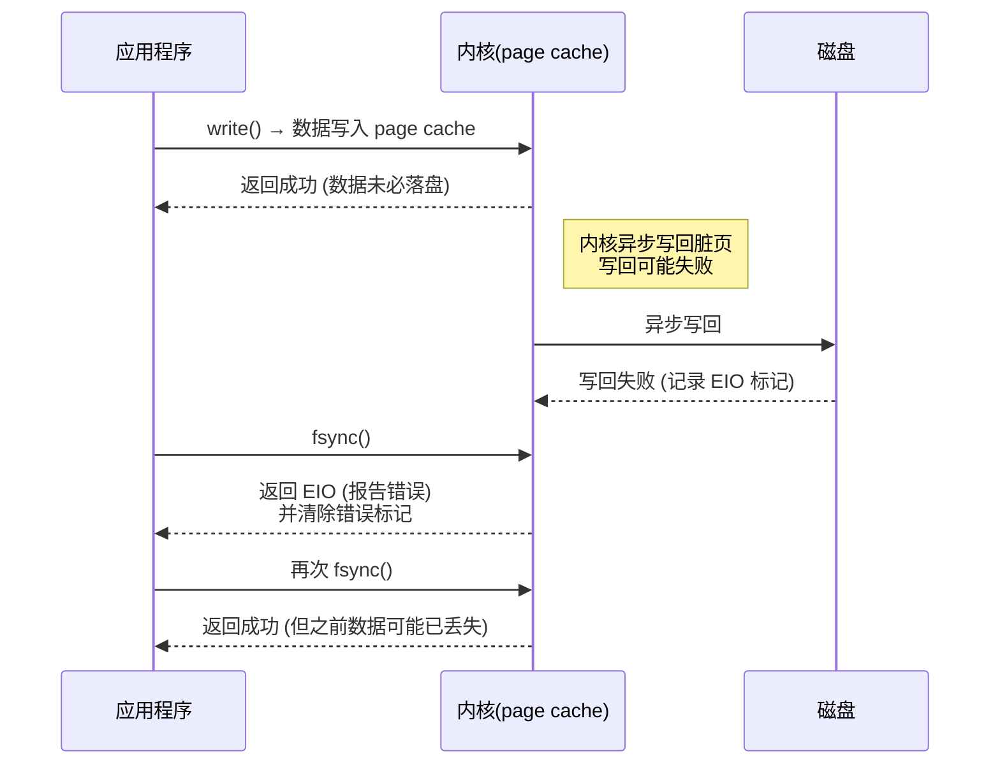

# `fsync`

`OS` 中 [`fsync()`](https://man7.org/linux/man-pages/man2/fsync.2.html) 系统函数的实现原理。

`fsync()` 是 `POSIX` 标准提供的一个系统调用函数，功能是将内存中的脏页刷新到磁盘进行持久化存储。

## 1. 基础知识

在应用程序调用 `write()` 函数且返回成功后，仅表示数据从用户空间复制到 `OS` 的 `page cache` 空间，数据有可能尚未真正写入磁盘。当 `OS` 异步刷新脏页数据到持久化存储设备时，可能会由于底层存储的错误导致写回失败，但无法将该失败上报给应用程序。

当应用程序未来**第一次**调用 `fsync()/fdatasync()/close()` 时，内核会捕获之前发生的写回失败并返回给应用程序错误码 `EIO`，同时清除该错误标记。

`Linux` 在 `fsync` 首次报告过历史写回错误后会 “消费/清除” 该错误标记；后续调用 `fsync` 可能成功，但并不意味着之前失败的写入已落盘。`POSIX` 对 `fsync` 失败后的状态无保证，因此对 “`fsync` 失败后重试是安全的” 的假设不成立。

### 1.1. 流程图

数据读写操作调用 `fsync` 的流程图：

该流程图展示了：

- `write()` 只负责进入内核缓冲区；
- 异步写回失败时，内核记录该错误；
- **第一次** `fsync()` 报告错误并清除标记；
- 后续再次 `fsync()` 返回成功，可能带来 “假安全”。

因此，`fsync()` 返回成功仅表示自上次调用 `fsync` 之后期间所有的修改已写入磁盘，并不表示自上次成功调用 `fsync` 后所有修改已写入磁盘。

## 2. 应用场景

不同应用程序进行文件读写操作时调用 `fsync()` 的实现流程，例如典型的使用场景包括数据库等。

### 2.1. `PostgreSQL`

在用户使用 `PostgreSQL` 数据库的过程中，如果由于底层存储的错误导致出现了数据损坏的问题，那么 `PostgreSQL` 对该问题有一定的责任，相关的讨论邮件列表: [PostgreSQL fsync error](https://www.postgresql.org/message-id/CAMsr+YHh+5Oq4xziwwoEfhoTZgr07vdGG+hu=1adXx59aTeaoQ@mail.gmail.com).

具体地，当 `PostgreSQL` 重试 `checkpoint` 操作时也会重试 `fsync`，因为之前的 `fsync` 调用已经将脏页写回错误的标记清除，使得这次 `fsync` 调用返回成功，进一步完成 `checkpoint` 操作（`WAL` 中 `REDO` 指针前移并删除旧 `WAL` 文件），但之前的脏页数据可能并未真正写入磁盘从而导致数据的丢失。

`PostgreSQL` 对 `fsync` 的错误使用已经有 20 年的历史了[2]。

因此，对数据文件/`WAL` 的 `fsync` 返回 `EIO` 时，`PostgreSQL` 应立即 `PANIC`，停止推进 `checkpoint` 并保留 `WAL`；不要把后续 “成功的” 重试当成之前所有数据的修改已安全落盘的证据。

## references

1. Can Applications Recover from fsync Failures? ATC 2020.
2. <https://archive.fosdem.org/2019/schedule/event/postgresql_fsync/>. 2019.
