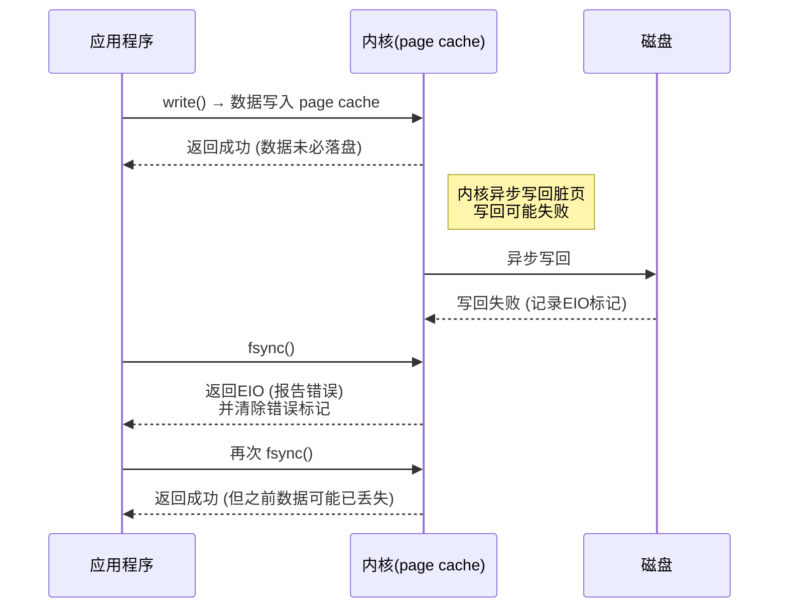

# fsync

OS 中 [fsync()](https://man7.org/linux/man-pages/man2/fsync.2.html) 系统函数的实现原理。

`fsync()` 是 POSIX 标准提供的一个系统调用函数，功能是将内存中的脏页刷新到磁盘进行持久化存储。

Linux 在首次 `fsync` 报告过历史写回错误后会 “消费/清除” 该错误标记；后续调用 `fsync` 可能成功，但并不意味着之前失败的写入已落盘。POSIX 对 `fsync` 失败后的状态无保证，因此对 “`fsync` 失败后重试是安全的” 的假设不成立。

## 1. 基础知识

在应用程序调用 `write()` 函数且返回成功后，仅表示数据从用户空间复制到 OS 的 page cache 空间，数据有可能尚未真正写入磁盘。当 OS 异步刷新脏页数据到持久化存储设备时，可能会由于底层存储的错误导致写回失败，但无法将该失败上报给应用程序。

当应用程序未来**第一次**调用 `fsync()/fdatasync()/close()` 时，内核会捕获之前发生的写回失败并返回给应用程序错误码 EIO，同时清除该错误标记。

### 1.1. 流程图

该流程图展示了：

- `write()` 只负责进入内核缓冲区；
- 异步写回失败时，错误先被记录；
- **第一次** `fsync()` 报告错误并清除标记；
- 后续再次 `fsync()` 返回成功，可能带来“假安全”。

## 2. 应用场景

不同应用程序中调用 `fsync()` 的实现流程。

### 2.1. `PostgreSQL`

在使用数据库 `PostgreSQL` 的过程中，当发生存储错误时会出现数据损坏的情况，`PostgreSQL` 也有一定的责任。与这个情况相关的讨论邮件：[PostgreSQL fsync error](https://www.postgresql.org/message-id/CAMsr+YHh+5Oq4xziwwoEfhoTZgr07vdGG+hu=1adXx59aTeaoQ@mail.gmail.com).

对数据文件/WAL 的 fsync 返回 EIO，应立即 PANIC，停止推进 `checkpoint` 并保留 WAL；不要把后续 “成功的” 重试当成数据已安全落盘的证据。

## References

1. Can Applications Recover from fsync Failures?
